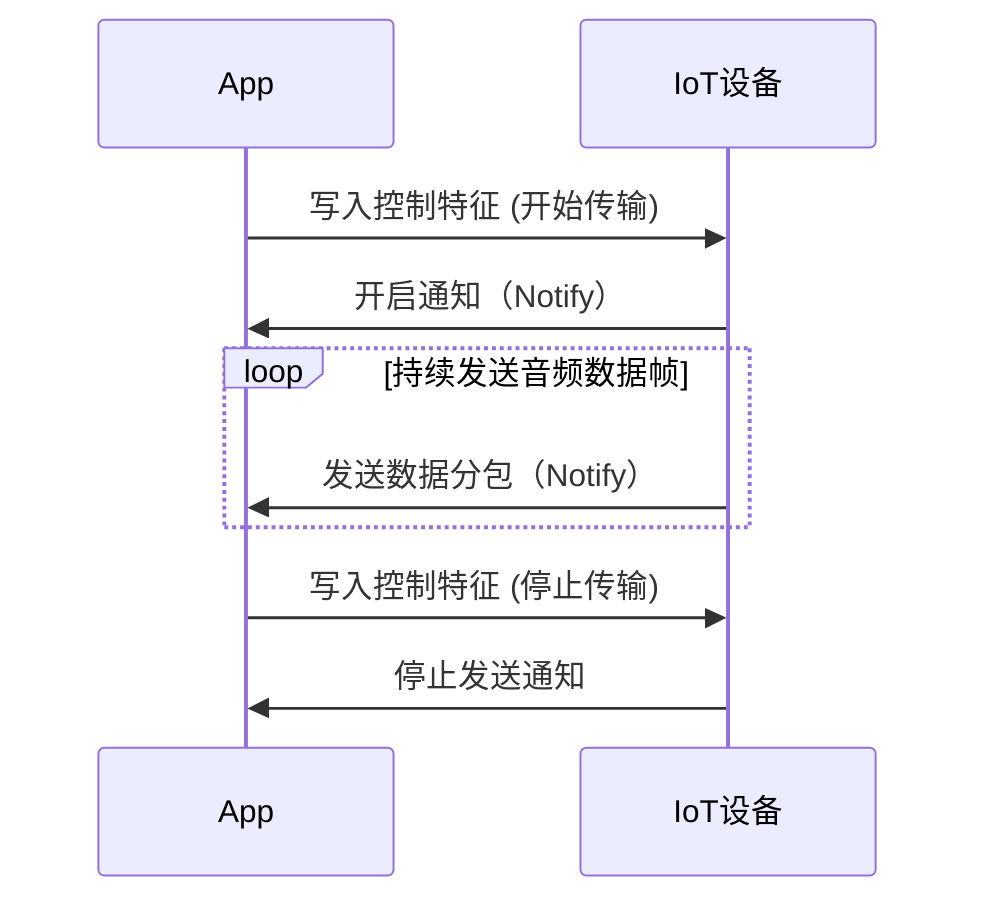

# 损伤检测

## 一、BLE GATT 服务与特征设计

定义一个自定义音频服务：

| **项目**  | **UUID（示例）**                     | **描述**                   |
| --------- | ------------------------------------ | -------------------------- |
| 服务 UUID | F000AA00-0451-4000-B000-000000000000 | 自定义音频服务             |
| 特征 UUID | F000AA01-0451-4000-B000-000000000000 | 音频数据传输特征（Notify） |
| 特征 UUID | F000AA02-0451-4000-B000-000000000000 | 控制命令特征（Write）      |
|           |                                      |                            |

## 二、数据分包与传输方式

**数据分包：**

&#x20;• BLE 每个包的 MTU 通常为**20\~512 字节**，推荐选择**200 字节**左右（支持扩展 MTU）。

&#x20;• **每个音频帧**可能大于 BLE 单包，需要进一步拆分：

&#x20;• 每次传输数据包结构：

```
数据包头（4字节） + 数据载荷（N字节）
```

**数据包头定义（4 字节）：**

| **字段**     | **字节数** | **描述**                        |
| ------------ | ---------- | ------------------------------- |
| Frame ID     | 2          | 当前音频帧编号（递增）          |
| Packet ID    | 1          | 当前音频帧内分包序号，从 0 开始 |
| Packet Count | 1          | 当前音频帧总包数                |

**数据载荷（Payload）：**

&#x20;• 剩余空间全部为音频数据，例如：

```
[Frame ID: 2B] [Packet ID: 1B] [Packet Count: 1B] [Payload <= 196B]
```

## 三、音频数据帧定义（示例）：

每个音频帧的数据：

&#x20;• 可采用低采样率语音格式（如 PCM、ADPCM、Opus 编码）。

&#x20;• 推荐参数：

&#x20;• PCM (16bit, 8kHz, 单声道) 或 ADPCM 压缩

&#x20;• 每帧长度建议为**160 字节\~400 字节**(20\~50ms 音频片段)

示例：

```
| 帧头 (4 Byte) | 音频数据 |
```

## 四、控制命令特征定义

为了便于 App 控制设备（如开始、停止传输，或设置参数），定义一个控制特征。

每次发送**4 字节**指令：

| **字段** | **字节数** | **描述**                                    |
| -------- | ---------- | ------------------------------------------- |
| 命令类型 | 1          | 0x01 开始传输；0x02 停止传输；0x03 查询状态 |
| 参数 1   | 1          | 音频类型 (0=PCM,1=ADPCM,2=OPUS)             |
| 参数 2   | 1          | 保留（备用，填充 0）                        |
| 校验位   | 1          | 校验位 = 命令类型^参数 1^参数 2（异或）     |

示例：

&#x20;• 开始传输 ADPCM 音频：

```
[0x01][0x01][0x00][0x00^(0x01^0x01)=0x00]
```

即：0x01 0x01 0x00 0x00

- &#x20;停止传输命令：

```
[0x02][0x00][0x00][0x02]
```

## 五、数据传输流程



## 六、数据重传与校验机制（可选）

&#x20;• App 端收到数据后，根据**帧编号 + 包序号**判断包的连续性：

&#x20;• 若有数据包缺失，通过控制特征发送一个特殊重传命令：

```
[0x04][Frame ID(2B)][Packet ID(1B)]
```

• IoT 设备收到重传请求后，立即重发对应包。
